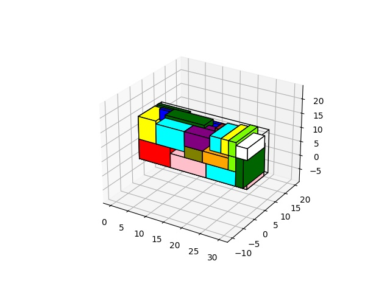

3D Bin Packing
====

3D Bin Packing improvements based on [this repository](https://github.com/jerry800416/3D-bin-packing).



## OutLine

- [3D Bin Packing](#3d-bin-packing)
    - [OutLine](#outline)
    - [Improvement](#improvement)
    - [How to use](#how-to-use)
    - [Example](#example)
        - [Simple example](#simple-example)
    - [Issue](#issue)
    - [Reference](#reference)

## Improvement
* Restructure project tree.
* Refactor code to google style.
* Implement `stackable` feature for Item class.
* Change sorting strategy before putting item to bin.

## How to use

**Init bin :**

```python
box1 = Bin(
    name='Bin',  # Bin's name
    whd=(589, 243, 259),  # (width, height, depth)
    max_weight=28080,  # box can bear the weight
    corner=15,  # container corner
    put_type = 1  # add the order of placing items
)
```

**Init item :**

```python
item1 = Item(
    partno='testItem',  # partno / PN of item (unique value)
    group='wash', # group of item
    type=Type.CUBE,  # cube or cylinder
    whd=(85, 60, 60),  # (width, height, depth)
    weight=10,  # item weight
    priority=1,  # priority (Item need to pack)
    loadbear=100,  # item bearing
    stackable=True, # allows stackable
    upsidedown=True,  # item fall down or not
    rotations=[0, 1, 3], # the list of allowed rotation type, default all
    color='#FFFF37'  # set item color , you also can use color='red' or color='r'
)
```

**Init packer :**

```python
packer = Packer()  # packer init
```

**Add bins and items to packer.**

```python
packer.add_bin(box1)  # adding bins to packer
packer.add_item(item1)  # adding items to packer
```

**Start pack items :**

```python
packer.pack(
    bigger_first=True,  # bigger item first.
    fix_point=True,  # fix item float problem.
    binding=[('server', 'cabinet')],  # make a set of items.
    distribute_items=True,  # If multiple bin, to distribute or not.
    check_stable=True,  # check stability on item.
    support_surface_ratio=0.75  # set support surface ratio.
)
```

**Results :**

```python
packer.bins  # get bin of packer
packer.bin[i].items  # get fitted items in bin
packer.unfit_items  # get unfitted items 
```

**Container Visualizer :**

```python
for b in packer.bins:
    visualizer = Visualizer(b)
    fig = visualizer.plot_box_and_items(
        title=b.name,
        alpha=0.8,  # set item alpha
        write_num=True,  # open/close write part number 
        fontsize=10,  # control font size
        show_empty=True, # show empty blocks
    )
fig.show() 
```

## Example

#### Simple example

```python
from py3dbp.packer import Packer
from py3dbp.item import Item
from py3dbp.bin import Bin
from py3dbp.visualizer import Visualizer
import time

start = time.time()

# init packing function
packer = Packer()

#  init bin
box = Bin('example', (30, 10, 15), 99, 0)
packer.add_bin(box)

#  add item
packer.add_item(Item('test1', 'test', Type.CUBE, (9, 8, 7), 1, 1, 100, True, 'red'))
packer.add_item(Item('test2', 'test', Type.CUBE, (4, 25, 1), 1, 1, 100, True, 'blue'))
packer.add_item(Item('test3', 'test', Type.CUBE, (2, 13, 5), 1, 1, 100, True, 'gray'))
packer.add_item(Item('test4', 'test', Type.CYLINDER, (7, 5, 4), 1, 1, 100, True, 'orange'))
packer.add_item(Item('test5', 'test', Type.CYLINDER, (10, 5, 2), 1, 1, 100, True, 'lawngreen'))

# calculate packing 
packer.pack(
    bigger_first=True,
    fix_point=True,
    distribute_items=True,
    check_stable=True,
    support_surface_ratio=0.75
)

# visualize the results
for b in packer.bins:
    visualizer = Visualizer(b)
    fig = visualizer.plot_box_and_items(
        title=b.name,
        alpha=0.7,
        write_num=True,
        fontsize=10
    )
fig.show()
```

## Issue
* N/A

## Reference

* [Optimizing three-dimensional bin packing through simulation](https://github.com/jerry800416/3dbinpacking/blob/master/reference/OPTIMIZING%20THREE-DIMENSIONAL%20BIN%20PACKING%20THROUGH%20SIMULATION.pdf)
* https://github.com/enzoruiz/3dbinpacking
* https://github.com/nmingotti/3dbinpacking
* https://github.com/jerry800416/3D-bin-packing
